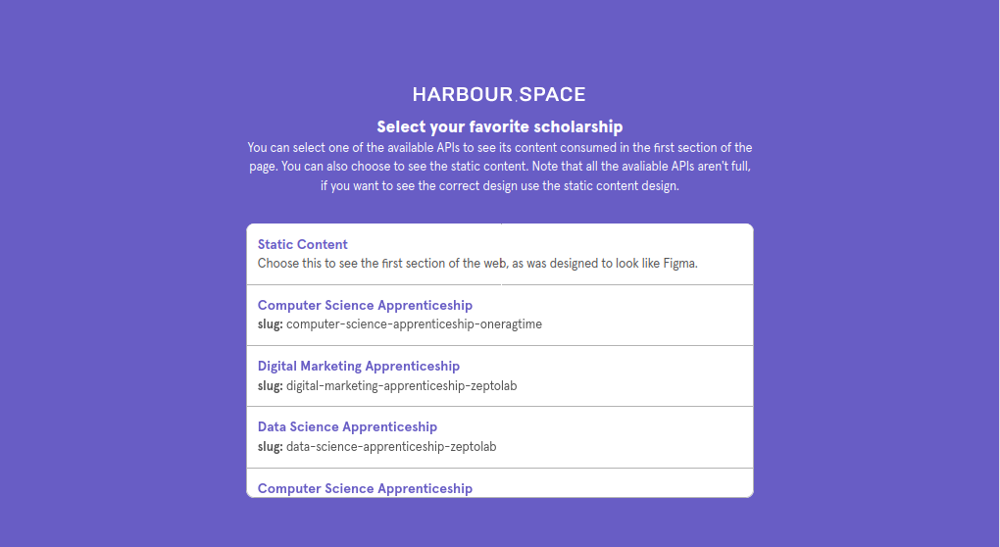
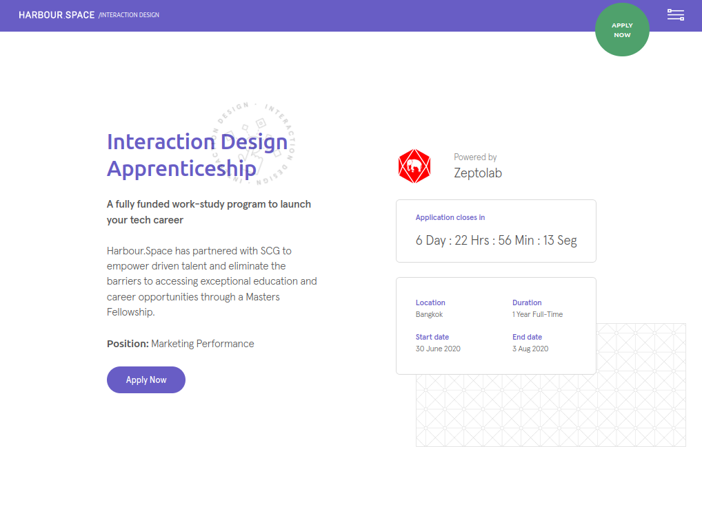
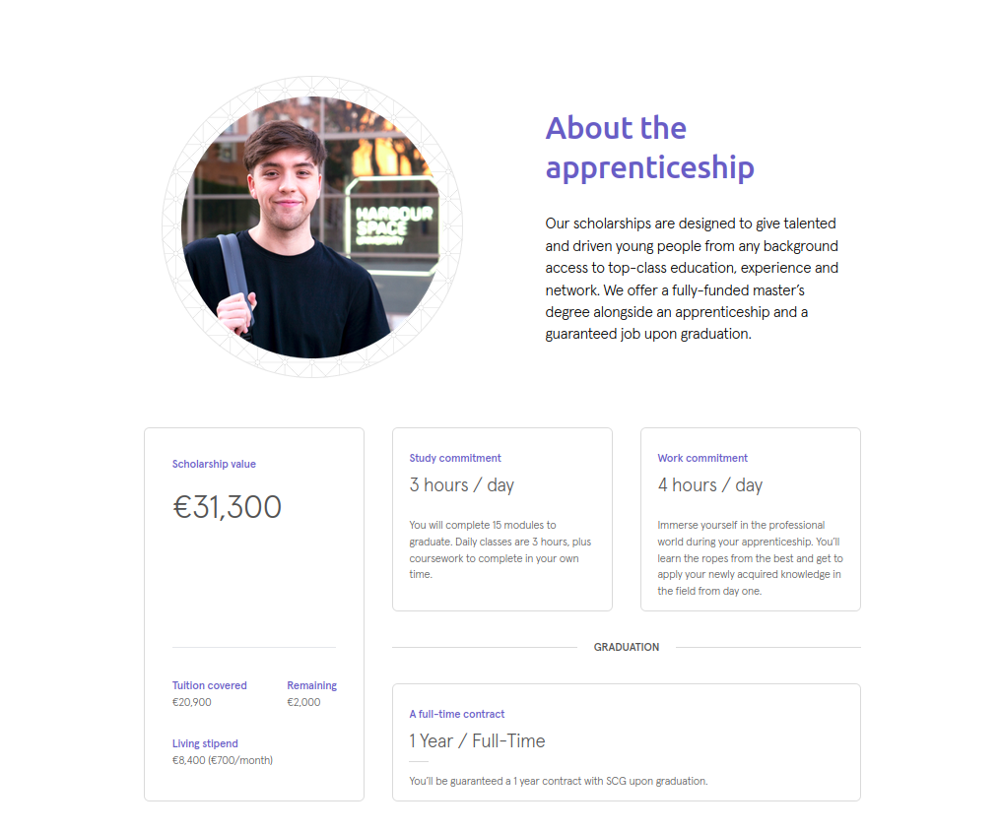
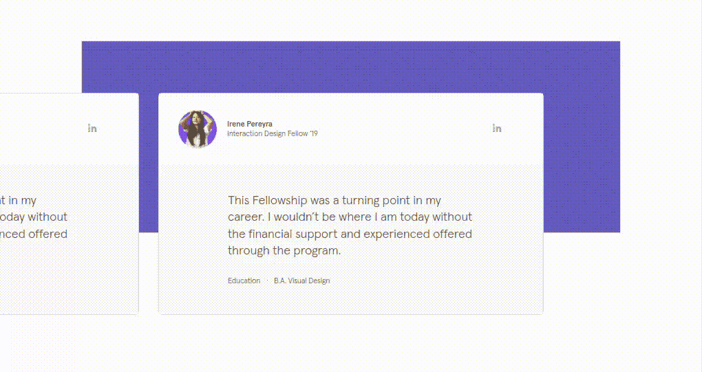
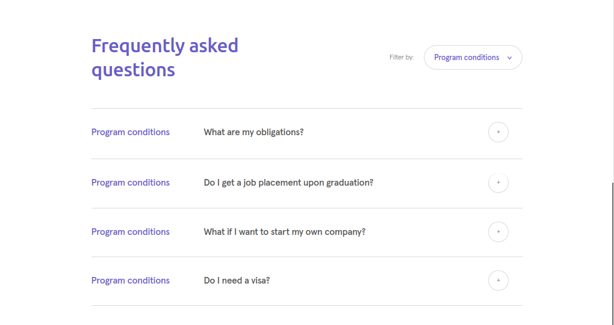
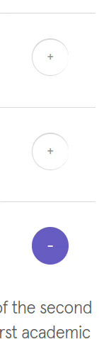
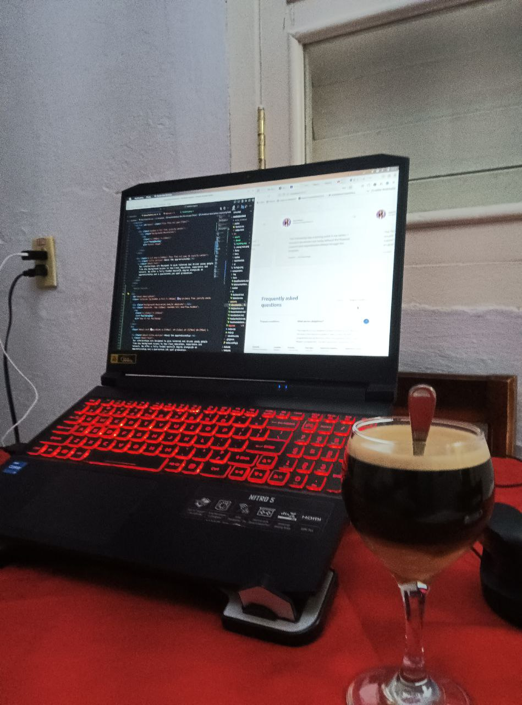

# Challenge of Harbour Space 🚀

This project is a responsive landing page, imitating the design of [Harbour Space](https://harbour.space). It features advanced animations using CSS + JavaScript. The project is built with:

- [Vue.js 3](https://vuejs.org)
- [Pinia](https://pinia.vuejs.org/) for state management
- [Tailwind CSS](https://tailwindcss.com)
- [Sass](https://sass-lang.com) (minimal use).

You can view the project live at [Freddy's HS Challenge](https://hschallenge.netlify.app/).

## Desktop Preview 🖥️

Upon startup, the site prompts the user to select an API for a specific scholarship. Due to time constraints, the API is only consumed and displayed in the first section, [HeroSection.vue](./src/sections/HeroSection.vue). However, data handling for displaying it throughout the project is implemented using [Pinia](https://pinia.vuejs.org/).

The API selection is located in the `/src/api.js` file:

```js
export const apiListUrl =
  "https://pre-prod.harbour.space/api/v1/scholarship_pages/";
```

This route indicates the different APIs available to the user, as shown in the following image:



Here's a demonstration of the landing page:

- 
- 
- 
- 
- 
- 

## Mobile Preview 📱

- 

## Installing the Project 🛠️

Ensure you have [Node.js](https://nodejs.org) and [npm](https://www.npmjs.com/) installed on your system. If you do, follow these steps:

### Clone the Project

```bash
git clone https://github.com/freddysae0/harbour-space.git
```

### Access the Project Folder

```bash
cd harbour-space
```

### Install Dependencies

```bash
npm i
```

### Run the Project Locally

```bash
npm run serve
```

If successful, the project will run in development mode on your system.

## Building the Project 🏗️

### Compile and Minify for Production

```bash
npm run build
```

This `readme.md` wasn't generated by AI; it was carefully crafted, including compressing GIFs with the Internet of Cuba. All information is organized for clarity. If you're interested in the project, consider leaving a star in the repo or following me. 🌟

PD:
Hay un [pdf autogenerado](./README.pdf), con el mismo contenido de este README.

## Development Process ☕



# That is all. Thanks for Reading!
